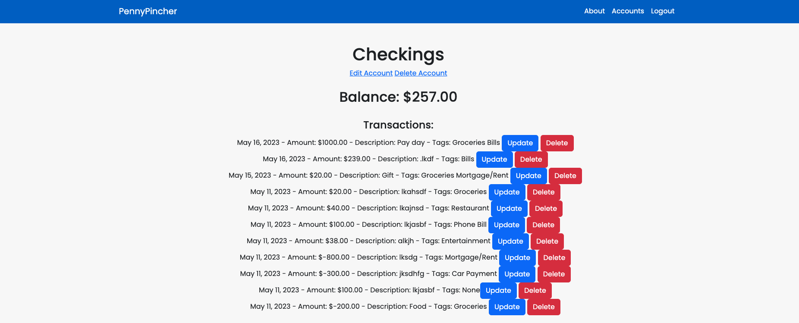

# PennyPincher

PennyPincher is a personal finance management app designed to help users track their expenses, manage their accounts, and gain insight into their spending habits. It provides a user-friendly interface to create and manage accounts, record transactions, and categorize expenses using tags.

Here is the link to the sight: https://pennypincher.herokuapp.com/

## Screenshots

## Technologies Used

- Python: The programming language used for the backend development of the app.
- Django: The web framework used to build the application and handle server-side operations.
- HTML/CSS: Used for the app's frontend design and styling.
- PostgreSQL: The database management system used to store account and transaction data.
- Bootstrap: A popular CSS framework used for responsive and visually appealing UI components.

## Planned Future Enhancements

- Budget Management: Add the ability for users to set budgets for different expense categories and receive alerts or notifications when approaching or exceeding the budget limits.
- Reports and Analytics: Provide visual reports and analytics to help users analyze their spending patterns, track trends, and make informed financial decisions.
- Integration with External Accounts: Although it's a longshot right now, I think it would be cool to enable users to connect and import transactions from their bank accounts or other financial platforms.